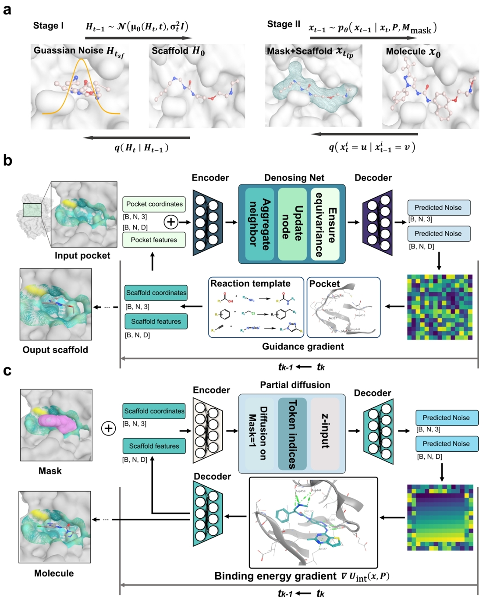

# RePaintMol
RePaintMol consists of two diffusion stages: scaffold generation and molecular inpainting. 
Specifically, constructing a complete molecule within the protein pocket involves a two-step reverse process: during Stage I, 
the reverse process from t→0 progressively transforms Gaussian noise into a coarse scaffold based on the physicochemical properties of the pocket; 
during Stage II, the reverse process from t→0 creates a mask based on the scaffold and pocket shape and subsequently "inpaints" the final molecule conditioned on both the mask and scaffold. 
Detailed framework of the Stage I reverse process (t→0), corresponding to scaffold generation: the protein pocket PPP and reaction template T are provided as inputs to an EGNN-based denoising network, 
which predicts the denoising direction. Chemical reaction priors and pocket-guided gradients are incorporated to adjust the predicted epsilon, from which the reverse mean H is computed.  
Detailed framework of the Stage II reverse process (t→0), corresponding to completing the molecule via inpainting: starting from the scaffold generated in Stage I, 
local molecular fragments are extracted and encoded into discrete tokens using a local VQ-VAE encoder. A decoder conditioned on the protein pocket embedding predicts 
the denoised masked tokens. Masked regions of the scaffold are progressively refined through partial discrete diffusion, while protein-ligand binding interactions are further incorporated 
via an energy-based gradient guidance mechanism during the denoising process. 



## Project Structure

```
RePaintMol/
├── data/                    # Data directory
├── configs.py               # Configuration file
├── data_utils.py            # Data processing and dataset code
├── models/                  # Model definitions (scaffold generator, inpainting)
├── train.py                 # Training script
├── sample.py                # Sampling/inference script
├── utils.py                 # Utility functions
├── requirements.txt         # Python dependencies
└── README.md                # Project documentation
```

## Main Features

1. **Data Preparation and Representation**
   - 3D point cloud representation for protein pockets and ligand molecules
   - Data preprocessing, normalization, and quality control

2. **Scaffold Generation**
   - Diffusion model-based molecular scaffold generation
   - Reaction templates and protein pocket-guided generation

3. **Molecular Inpainting**
   - Partial denoising diffusion process (PDDP) for structure refinement
   - Molecular structure optimization

4. **Training Strategy**
   - Two-stage training paradigm
   - Global VQ-VAE pretraining
   - Scaffold generation and inpainting
   - Separate training configs for scaffold and inpainting models


## Running Environment

The training code has been tested on Linux Ubuntu 22.04 with two GTX-4090 GPUs, while molecule generation has been tested on Linux Ubuntu 22.04, Mac, and Windows 11.


## Installation

```bash
pip install -r requirements.txt
```

## Usage

### Training

```bash
python train.py
```
- Training parameters for scaffold generator and inpainting model can be set separately in `configs.py` under `SCAFFOLD_TRAIN` and `INPAINTING_TRAIN`.

### Sampling/Inference

```bash
python sample.py -n 1000 -pdb_path data/pocket.pdb
```
- `-n`: Number of molecules to generate
- `-pdb_path`: Path to the input pocket PDB file

### Data Preparation
- Place your protein and ligand files in the `data/` directory. See `data_utils.py` for details on supported formats.

## Dependencies

- See `requirements.txt` for all dependencies (PyTorch, RDKit, pdbfixer, wandb, etc.)

## Citation

To be updated...

## Others

If you encounter any issues, please contact us at <a href="mailto:11919015@zju.edu.cn" style="color: blue;">11919015@zju.edu.cn</a>.
